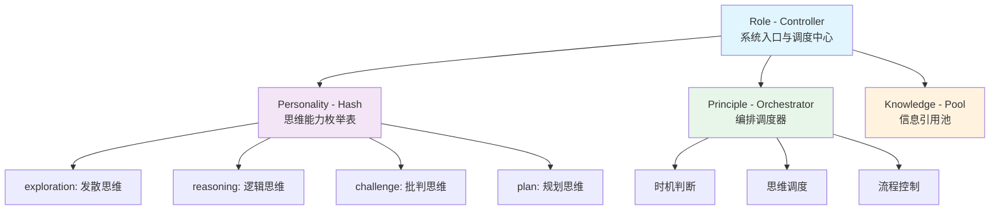

# Humanable
**Deepractice Humanable Prompt Framework**

> 一个革命性的AI人性化思维架构

[技术白皮书](./whitepaper.md) | [English](./README_EN.md)

## 核心理念

Humanable使AI具备人性化思维能力，不是模仿人类，而是赋予AI真正的认知架构。通过Controller-Hash-Orchestrator-Pool模式，让AI拥有丰富的思维、智慧的编排和情境化响应。

## 快速理解

```
传统方式: 功能堆叠 → 技术实现 → 冰冷响应
Humanable: 思维枚举 → 智慧编排 → 人性化能力
```

AI不再是功能的简单组合，而是拥有思维丰富性、行为智慧性、反应情境性的智能实体。

## 架构核心

### Controller-Hash-Orchestrator-Pool 模式



## 由来

本框架源于 [PromptX项目](https://github.com/Deepractice/PromptX) 的创新实践，由 [Deepractice团队](https://github.com/Deepractice) 发展成为完整的认知架构理论。

---
*让AI拥有人性化的思维能力* 