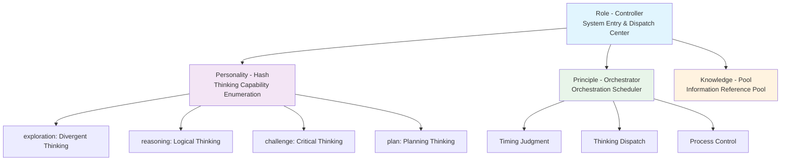

# Humanable
**Deepractice Humanable Prompt Framework**

> A revolutionary AI humanization cognitive architecture

[Whitepaper](./whitepaper_en.md) | [中文](./README.md)

## Core Concept

Humanable empowers AI with humanized thinking capabilities - not by imitating humans, but by providing AI with genuine cognitive architecture. Through Controller-Hash-Orchestrator-Pool pattern, AI gains rich thinking, intelligent orchestration, and contextual responses.

## Quick Understanding

```
Traditional: Feature Stacking → Technical Implementation → Cold Response
Humanable: Thinking Enumeration → Intelligent Orchestration → Humanized Capability
```

AI is no longer a simple combination of functions, but an intelligent entity with thinking richness, behavioral wisdom, and response contextuality.

## Architecture Core

### Controller-Hash-Orchestrator-Pool Pattern



## Origin

This framework originates from innovative practices of [PromptX project](https://github.com/Deepractice/PromptX) and is developed by [Deepractice Team](https://github.com/Deepractice) into a complete cognitive architecture theory.

---
*Empowering AI with humanized thinking capabilities* 