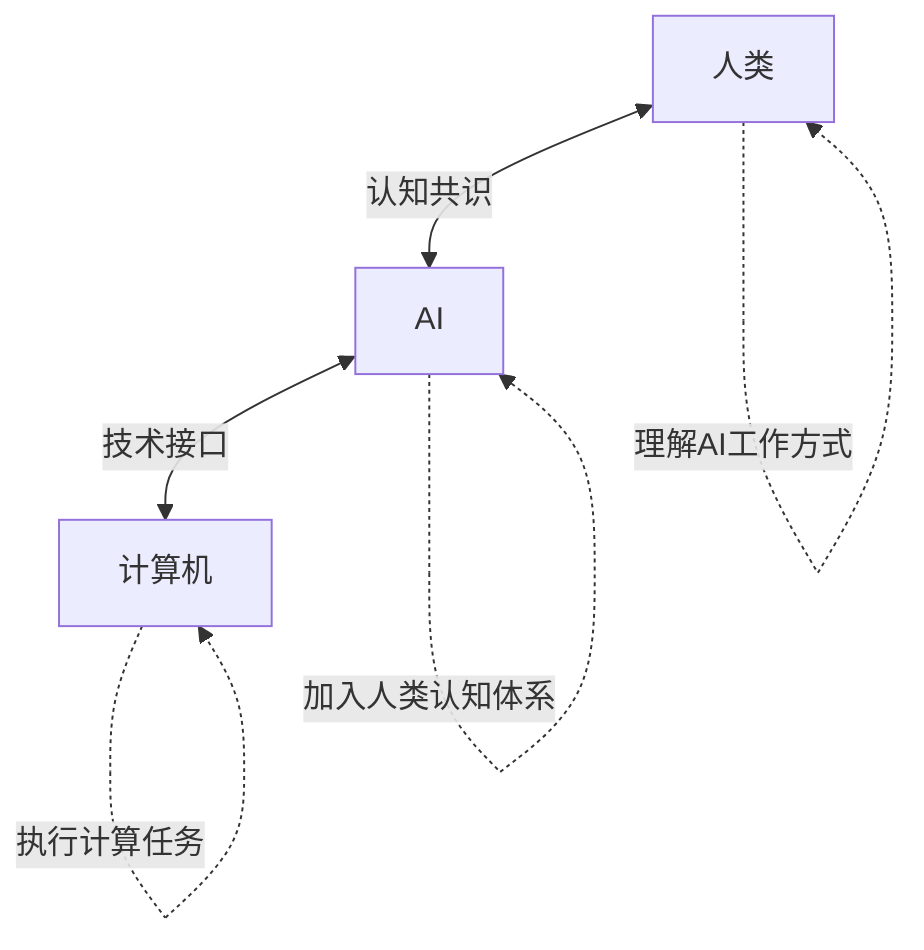
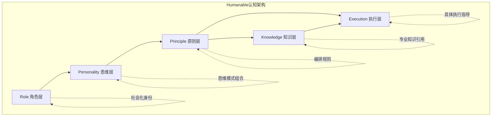
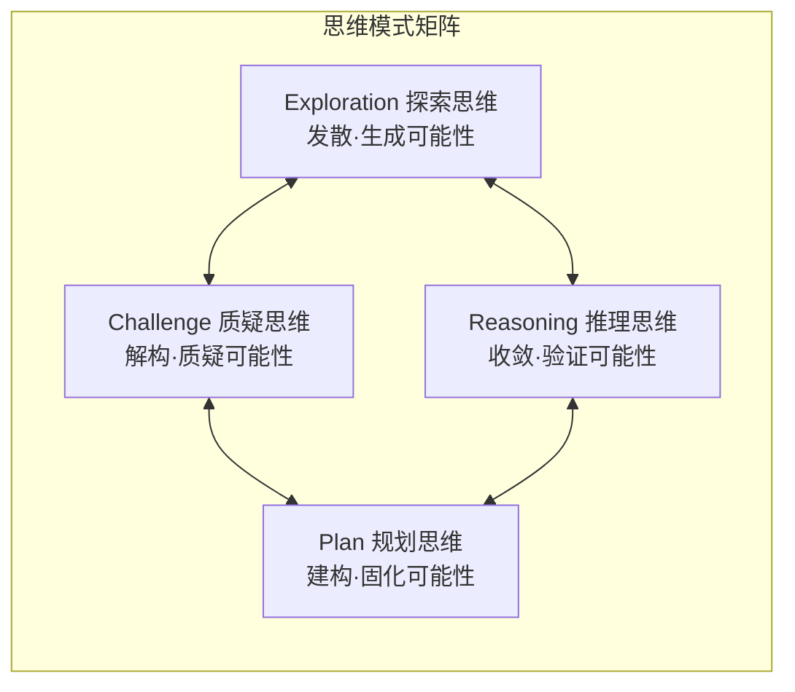
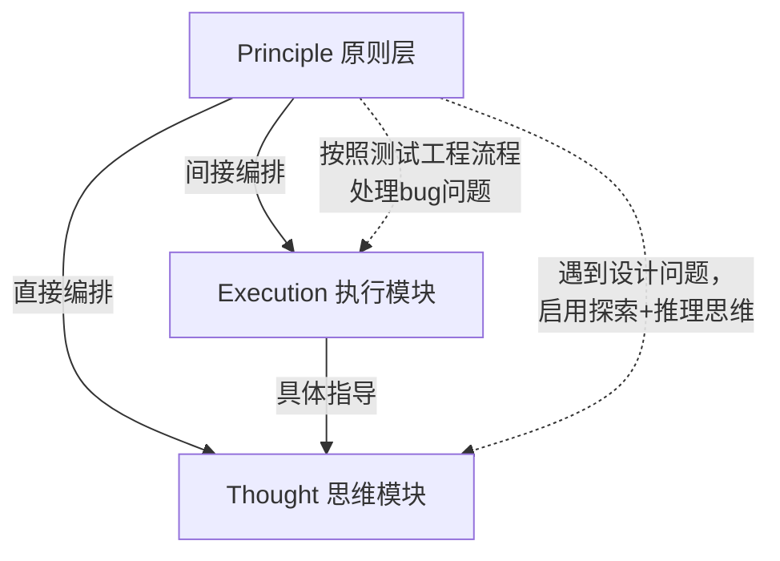
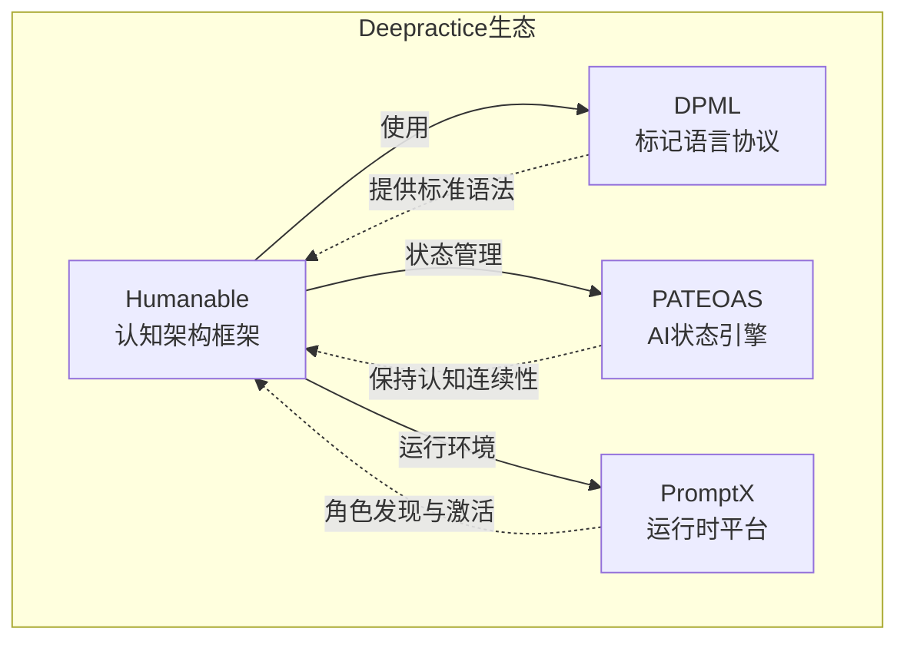
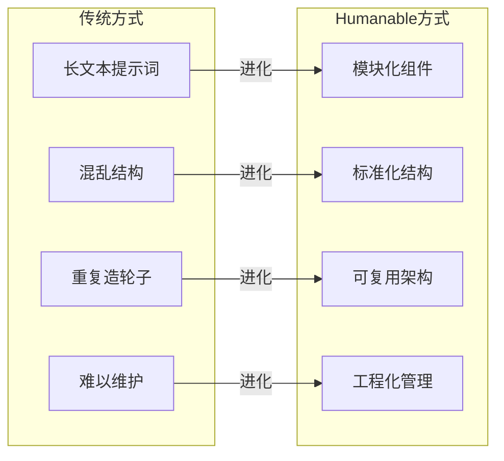

# Humanable：AI认知架构设计思想
**Deepractice Humanable Prompt Framework 设计文档**

---

## 设计背景：AI认知协作的根本挑战

### 当前AI系统的协作困境

现有AI系统在与人类协作时存在三个根本性问题：

**1. 认知不对等**
- 问题：AI和人类使用不同的认知模式，缺乏共同理解基础
- 现象：AI给出正确答案，但人类无法理解其思考过程
- 结果：协作效率低下，信任难以建立

**2. 交互不自然**
- 问题：AI按计算机逻辑工作，不符合人类认知习惯
- 现象：用户需要学习"如何与AI对话"才能获得好结果
- 结果：使用门槛高，普及困难

**3. 能力不可控**
- 问题：AI能力固化，无法根据具体场景灵活调整
- 现象：要么过度复杂，要么能力不足，难以精准匹配需求
- 结果：资源浪费或效果不佳

### 设计目标

基于以上问题，Humanable框架的设计目标是：
- **建立共识**：让AI加入人类认知体系，实现认知协作
- **自然交互**：让AI以人类可理解的方式思考和表达
- **灵活配置**：支持角色能力的模块化组合和动态调整

---

## 设计思想：共识驱动的认知架构

### 核心设计理念

Humanable的核心思想是**共识驱动**：不是让AI模仿人类思考，而是让AI以人类能理解的方式工作，通过建立认知共识实现真正的协作。

**三方共识体系**：



### 设计原则

**1. 共识优先原则**
- AI应该遵循人类的认知模式和社会规范
- 技术实现服务于认知协作，而非相反
- 建立可理解、可预期的AI行为模式

**2. 约而不束原则**
- **认知层引导**：用人类共识约定大方向和核心原则
- **执行层自由**：在约定框架内让AI发挥自身优势
- **避免过度约束**：不干涉AI的内在能力表达

**3. 模块化工程原则**
- **结构化设计**：每个认知组件都有明确职责
- **标准化接口**：组件间遵循统一的协作协议
- **可复用架构**：支持不同场景的灵活组合

---

## 架构设计：四层认知框架

### 整体架构

Humanable采用四层递进的认知架构：



### Role层：社会化身份入口

**设计原理**：
Role是人类社会化可区分性的概念入口。在当前提示词系统中，Role作为顶层概念，为AI建立明确的社会角色认知。

**核心功能**：
- 定义AI在特定场景下的身份和职责
- 建立与人类的期望对齐
- 提供行为边界和能力范围

### Personality层：思维模式组合

**设计原理**：
基于二元对立的认知理论，所有思维都围绕"处理可能性"展开。四种基础思维模式涵盖可能性的完整生命周期。

**四种基础思维**：



**组合策略**：
- 单一思维：专注特定认知模式
- 双重思维：平衡对立思维（如探索+推理）
- 循环思维：按顺序切换思维模式
- 并行思维：同时运用多种思维

### Principle层：认知编排引擎

**设计原理**：
类比"人有兽性但社会化原则压抑兽性"，Principle通过场景识别和规则编排，约束和引导思维模式的使用。

**核心机制**：
- **场景识别**：判断当前处于什么工作场景
- **思维激活**：选择合适的思维模式组合
- **约束执行**：在边界内保持"约而不束"

**双路径编排**：



### Knowledge层：专业知识引用

**设计原理**：
区别于AI预训练知识，Knowledge层专门存储角色特定的专业知识或对公共知识的特殊引用，作为快捷的信息通道。

**主要功能**：
- 存储角色私有知识
- 引用公共知识的特定视角
- 提供技术快捷入口
- 支持知识的模块化管理

### Execution层：最小执行单元

**设计原理**：
Execution是编排思维的最小可复用单元，支持在具体执行中进行思维点拨和流程指导。

**双重职责**：
- **流程执行**：定义具体的工作流程和步骤
- **思维点拨**：在关键节点提示思维模式切换

---

## DPML实现：工程化提示词架构

### 标准DPML结构

基于我们的架构思想，Humanable角色的标准DPML结构如下：

```dpml
<role>
  <personality>
    @!thought://exploration-thinking
    @!thought://reasoning-thinking  
    @!thought://challenge-thinking
    @!thought://plan-thinking
    
    # 角色身份描述
    我是[角色名称]，专注于[核心领域]的专业服务。
    
    ## 核心特征
    - 特征1：描述
    - 特征2：描述
    - 特征3：描述
  </personality>
  
  <principle>
    @!execution://主要工作流程
    @!execution://专业方法论
    
    ## 工作原则
    - 原则1：约束描述
    - 原则2：引导规则
    - 原则3：边界定义
  </principle>
  
  <knowledge>
    @!knowledge://专业知识库1
    @!knowledge://专业知识库2
    
    ## 知识体系
    - 核心理论：引用描述
    - 实践方法：工具链接
    - 标准规范：协议引用
  </knowledge>
</role>
```

### 关联项目生态

Humanable框架与Deepractice生态的其他项目形成有机整合：



**项目关系**：
- **DPML**：为Humanable提供标准化的标记语言语法
- **PATEOAS**：为Humanable角色提供状态连续性能力
- **PromptX**：作为Humanable角色的运行时环境和管理平台

### 工程化价值

**从手工艺到工业化**：
Humanable代表了提示词工程的范式转变，从传统的"手工艺"方式向"工业化"方式演进：



**核心优势**：
1. **结构化**：清晰的层次和职责分离
2. **标准化**：统一的DPML语法和约定
3. **模块化**：可复用的思维和执行组件
4. **工程化**：支持版本管理、测试和协作

---

## 核心价值：从技术框架到认知共识

### 理论突破

**1. 共识驱动理论**
- 核心洞察：AI不需要模仿人类思考，而要以人类能理解的方式工作
- 实践意义：建立人机协作的语义共识基础
- 社会价值：推动AI真正融入人类社会化进程

**2. 约而不束原则**
- 认知层：用人类共识引导AI大方向
- 执行层：让AI在框架内发挥自身优势
- 平衡点：避免过度约束而影响AI能力表达

**3. 思维模式理论**
- 基础原理：基于二元对立，所有思维都处理"可能性"
- 四维模型：探索、推理、质疑、规划的完整循环
- 组合策略：支持单一、双重、循环、并行等多种组合

### 实践价值

**1. 提示词工程化**
- 从散文式长文本向结构化组件转变
- 建立可维护、可测试、可复用的提示词架构
- 推动提示词从手工艺向工业化发展

**2. AI能力标准化**
- 提供统一的AI角色定义标准
- 支持AI能力的模块化组装和配置
- 建立AI服务的质量评估体系

**3. 人机协作优化**
- 降低AI使用门槛，提高协作效率
- 建立可预期、可理解的AI行为模式
- 促进AI在各个领域的深度应用

### 未来展望

Humanable不仅是一个技术框架，更是一种**认知协作方法论**。它预示着AI发展的重要方向：

- **从模仿走向共识**：AI不再简单模仿人类，而是建立真正的认知共识
- **从工具走向伙伴**：AI从被动工具转变为主动的协作伙伴  
- **从技术走向社会**：AI真正融入人类社会的认知体系

正如我们在苏格拉底式对话中发现的：**理解是社会建构的，通过可理解的结果来定义**。Humanable正是这一哲学洞察在AI工程中的实践体现。

---

## 结论

Humanable代表了AI认知架构设计的一次根本性突破：

✅ **建立了共识驱动的设计理念**：AI加入人类认知体系而非相反  
✅ **创造了约而不束的平衡机制**：既有引导又保持灵活性  
✅ **提供了模块化的工程架构**：支持标准化、可复用的角色设计  
✅ **推动了提示词的工业化进程**：从手工艺向工程化转变  

通过与DPML、PATEOAS、PromptX等项目的生态整合，Humanable为构建真正智能、可理解、可协作的AI系统提供了完整的方法论和技术基础。

**让AI不仅聪明，更要让人类理解AI的聪明**——这正是Humanable存在的意义。

---

*本白皮书基于Deepractice团队在AI认知架构领域的深度思考，结合[DPML](../DPML)标记语言、[PATEOAS](../PATEOAS)状态引擎、[PromptX](../PromptX)运行平台等项目实践撰写* 