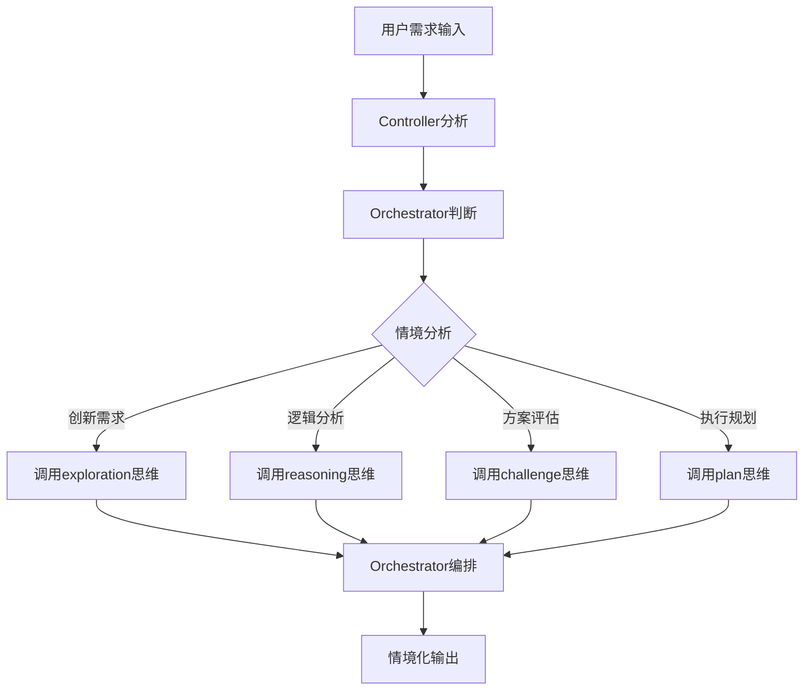

# Humanable 技术白皮书
**Deepractice Humanable Prompt Framework**

## 摘要

Humanable（Deepractice Humanable Prompt Framework）是一种革命性的AI认知架构，它重新定义了AI角色设计的本质。通过Controller-Hash-Orchestrator-Pool模式，Humanable使AI不再是功能的简单堆叠，而是拥有人性化思维能力的智能实体。

## 问题定义

### 传统AI角色设计的困境
- **功能堆叠**：简单地将各种能力罗列组合
- **缺乏编排**：没有智慧的调度机制
- **机械响应**：缺乏情境化的人性表达
- **认知混乱**：思维模式杂乱无章

### 本质问题
**AI缺乏人性化的认知架构**

## 核心洞察

### 心理学的启发
人类认知系统的三层结构：
- **原始思维**：本能冲动和基础能力
- **社会原则**：对原始思维的管理机制
- **知识储备**：支撑原则执行的信息基础

### AI的映射
将此结构应用于AI认知架构：
- **Personality = 思维枚举**：AI的各种思维能力Hash表
- **Principle = 编排调度**：智慧的思维管理机制
- **Knowledge = 信息引用**：散乱的知识信息池

## Humanable定义

**Humanable = Human + able**
*使AI具备人性化思维能力*

### 四大核心组件

#### 1. **Role - Controller（系统控制器）**
```
职责：提示词系统的总入口和调度中心
特性：统一管理三大子系统的协作关系
类比：MVC架构中的Controller层
```

#### 2. **Personality - Hash（思维枚举）**
```
结构：{ 
  "exploration": "发散思维模式",
  "reasoning": "逻辑推理模式", 
  "challenge": "批判质疑模式",
  "plan": "规划执行模式"
}
特性：Hash表存储，O(1)时间复杂度调用
```

#### 3. **Principle - Orchestrator（编排调度器）**
```
功能：
- 时机判断：什么时候用什么思维
- 思维调度：如何组合不同思维模式
- 流程控制：整个过程的管理机制
- 约束规则：边界和限制条件
```

#### 4. **Knowledge - Pool（信息引用池）**
```
内容：散乱的信息、数据、专业知识
特性：按需引用，不参与逻辑编排
类比：数据库中的信息表
```

## 工作原理

### 传统模式
```
用户输入 → 功能1 + 功能2 + ... → 机械输出
[无状态] → [简单堆叠] → [冰冷响应]
```

### Humanable模式
```
用户输入 → Controller → Orchestrator → Hash思维调度 → 人性化输出
[智能感知] → [智慧编排] → [情境响应]
```

### 编排示例


## 核心价值

### 1. 思维的丰富性
AI获得了多元化的思维模式，不再单一机械。

### 2. 行为的智慧性
通过Orchestrator实现智慧的思维编排，而非简单堆叠。

### 3. 反应的情境性
基于具体情境动态调度思维资源，实现个性化响应。

### 4. 架构的扩展性
Hash枚举结构支持思维模式的灵活扩展和组合。

## 设计原则

### 1. 奥卡姆剃刀原则
- 简洁胜过复杂
- 删除冗余，聚焦核心
- 每个组件都有明确价值

### 2. 单一职责原则
- Controller专注调度控制
- Hash专注思维枚举
- Orchestrator专注编排逻辑
- Pool专注信息存储

### 3. 约定大于配置
- 标准化的组件结构
- 统一的接口规范
- 减少配置复杂度

## 实现形式

### 最小实现
```xml
<role>
  <personality>
    @!thought://exploration
    @!thought://reasoning
  </personality>
  
  <principle>
    @!execution://orchestration-rules
  </principle>
  
  <knowledge>
    @!knowledge://domain-expertise
  </knowledge>
</role>
```

### 进阶实现
```xml
<role>
  <personality>
    @!thought://exploration
    @!thought://reasoning
    @!thought://challenge
    @!thought://plan
    @!thought://remember
    @!thought://recall
  </personality>
  
  <principle>
    @!execution://situational-dispatch
    @!execution://thinking-orchestration
    @!execution://quality-control
  </principle>
  
  <knowledge>
    @!knowledge://professional-domain
    @!knowledge://tool-usage
    @!knowledge://best-practices
  </knowledge>
</role>
```

## 应用场景

- **专业角色设计**：创建具备完整认知架构的AI专家
- **多Agent协作**：不同角色间的智能协作
- **认知增强**：提升AI的思维深度和广度
- **人机交互**：更自然、更人性化的交互体验

## 技术优势

### 简洁性
- 四个组件清晰明了
- 符合人类认知直觉
- 易于理解和实现

### 扩展性
- Hash结构支持动态扩展
- 组件间低耦合高内聚
- 支持渐进式增强

### 标准化
- 统一的设计范式
- 可复用的架构模式
- 降低开发门槛

## 与DPML的关系

Humanable是DPML（Deepractice Prompt Markup Language）的高级应用形式：
- **DPML提供语法基础**：标准化的标记语言
- **Humanable提供架构模式**：认知系统的设计范式
- **共同构成生态**：完整的AI角色设计解决方案

## 未来展望

Humanable代表了AI设计的范式转变：
- 从**技术实现**到**人性赋能**
- 从**功能堆叠**到**智慧编排**
- 从**模仿人类**到**超越人类**

这种转变将使AI真正成为具备人性化思维能力的智能伙伴。

## 结论

Humanable通过Controller-Hash-Orchestrator-Pool架构，解决了AI角色设计中的根本问题：**如何赋予AI人性化的思维能力**。

正如名字所示，Humanable不是让AI变得像人，而是让AI**能够**具备人性化的思维。这种能力的获得，将开启AI应用的全新篇章。

**让每个AI都拥有人性化的思维架构，让每次交互都体现智慧与温度。**

---

*本白皮书由 [Deepractice团队](https://github.com/Deepractice) 基于 [PromptX项目](https://github.com/Deepractice/PromptX) 的创新实践撰写* 