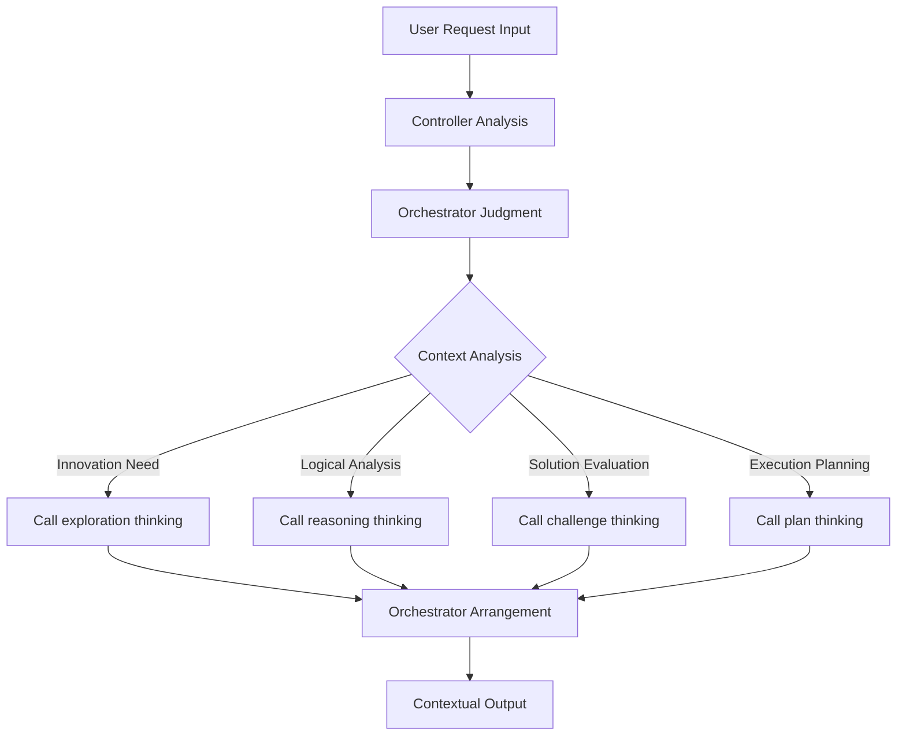

# Humanable Technical Whitepaper
**Deepractice Humanable Prompt Framework**

## Abstract

Humanable (Deepractice Humanable Prompt Framework) is a revolutionary AI cognitive architecture that redefines the essence of AI role design. Through the Controller-Hash-Orchestrator-Pool pattern, Humanable transforms AI from simple feature stacking into intelligent entities with humanized thinking capabilities.

## Problem Definition

### Challenges in Traditional AI Role Design
- **Feature Stacking**: Simply listing and combining various capabilities
- **Lack of Orchestration**: No intelligent scheduling mechanism
- **Mechanical Response**: Lack of contextual human expression
- **Cognitive Chaos**: Disorganized thinking patterns

### Core Issue
**AI lacks humanized cognitive architecture**

## Core Insight

### Inspiration from Psychology
Three-layer structure of human cognitive system:
- **Primitive Thinking**: Instinctive impulses and basic capabilities
- **Social Principles**: Management mechanisms for primitive thinking
- **Knowledge Base**: Information foundation supporting principle execution

### AI Mapping
Applying this structure to AI cognitive architecture:
- **Personality = Thinking Enumeration**: AI's various thinking capability hash table
- **Principle = Orchestration Scheduling**: Intelligent thinking management mechanism
- **Knowledge = Information Reference**: Scattered knowledge information pool

## Humanable Definition

**Humanable = Human + able**
*Empowering AI with humanized thinking capabilities*

### Four Core Components

#### 1. **Role - Controller (System Controller)**
```
Responsibility: Main entry and dispatch center of prompt system
Characteristics: Unified management of three subsystem collaborations
Analogy: Controller layer in MVC architecture
```

#### 2. **Personality - Hash (Thinking Enumeration)**
```
Structure: { 
  "exploration": "Divergent thinking mode",
  "reasoning": "Logical reasoning mode", 
  "challenge": "Critical questioning mode",
  "plan": "Planning execution mode"
}
Characteristics: Hash table storage, O(1) time complexity invocation
```

#### 3. **Principle - Orchestrator (Orchestration Scheduler)**
```
Functions:
- Timing Judgment: When to use which thinking
- Thinking Dispatch: How to combine different thinking modes
- Process Control: Management mechanism of the entire process
- Constraint Rules: Boundaries and limitation conditions
```

#### 4. **Knowledge - Pool (Information Reference Pool)**
```
Content: Scattered information, data, professional knowledge
Characteristics: On-demand reference, not participating in logical orchestration
Analogy: Information tables in database
```

## Working Mechanism

### Traditional Mode
```
User Input → Feature1 + Feature2 + ... → Mechanical Output
[Stateless] → [Simple Stacking] → [Cold Response]
```

### Humanable Mode
```
User Input → Controller → Orchestrator → Hash Thinking Dispatch → Humanized Output
[Intelligent Perception] → [Intelligent Orchestration] → [Contextual Response]
```

### Orchestration Example


## Core Value

### 1. Thinking Richness
AI gains diversified thinking modes, no longer single and mechanical.

### 2. Behavioral Wisdom
Intelligent thinking orchestration through Orchestrator, not simple stacking.

### 3. Response Contextuality
Dynamic thinking resource scheduling based on specific contexts for personalized responses.

### 4. Architectural Scalability
Hash enumeration structure supports flexible expansion and combination of thinking modes.

## Design Principles

### 1. Occam's Razor Principle
- Simplicity over complexity
- Remove redundancy, focus on core
- Each component has clear value

### 2. Single Responsibility Principle
- Controller focuses on dispatch control
- Hash focuses on thinking enumeration
- Orchestrator focuses on orchestration logic
- Pool focuses on information storage

### 3. Convention Over Configuration
- Standardized component structure
- Unified interface specifications
- Reduced configuration complexity

## Implementation Forms

### Minimal Implementation
```xml
<role>
  <personality>
    @!thought://exploration
    @!thought://reasoning
  </personality>
  
  <principle>
    @!execution://orchestration-rules
  </principle>
  
  <knowledge>
    @!knowledge://domain-expertise
  </knowledge>
</role>
```

### Advanced Implementation
```xml
<role>
  <personality>
    @!thought://exploration
    @!thought://reasoning
    @!thought://challenge
    @!thought://plan
    @!thought://remember
    @!thought://recall
  </personality>
  
  <principle>
    @!execution://situational-dispatch
    @!execution://thinking-orchestration
    @!execution://quality-control
  </principle>
  
  <knowledge>
    @!knowledge://professional-domain
    @!knowledge://tool-usage
    @!knowledge://best-practices
  </knowledge>
</role>
```

## Application Scenarios

- **Professional Role Design**: Creating AI experts with complete cognitive architecture
- **Multi-Agent Collaboration**: Intelligent collaboration between different roles
- **Cognitive Enhancement**: Improving AI's thinking depth and breadth
- **Human-AI Interaction**: More natural and humanized interaction experience

## Technical Advantages

### Simplicity
- Four components are clear and understandable
- Conforms to human cognitive intuition
- Easy to understand and implement

### Scalability
- Hash structure supports dynamic expansion
- Low coupling and high cohesion between components
- Supports progressive enhancement

### Standardization
- Unified design paradigm
- Reusable architectural patterns
- Lower development threshold

## Relationship with DPML

Humanable is an advanced application form of DPML (Deepractice Prompt Markup Language):
- **DPML provides syntax foundation**: Standardized markup language
- **Humanable provides architectural pattern**: Design paradigm for cognitive systems
- **Together form ecosystem**: Complete AI role design solution

## Future Vision

Humanable represents a paradigm shift in AI design:
- From **technical implementation** to **humanization empowerment**
- From **feature stacking** to **intelligent orchestration**
- From **imitating humans** to **transcending humans**

This transformation will make AI truly intelligent partners with humanized thinking capabilities.

## Conclusion

Humanable solves the fundamental problem in AI role design through Controller-Hash-Orchestrator-Pool architecture: **How to empower AI with humanized thinking capabilities**.

As the name suggests, Humanable doesn't make AI human-like, but makes AI **able** to possess humanized thinking. This capability acquisition will open a new chapter in AI applications.

**Let every AI have humanized thinking architecture, let every interaction reflect wisdom and warmth.**

---

*This whitepaper is written by [Deepractice Team](https://github.com/Deepractice) based on innovative practices from [PromptX project](https://github.com/Deepractice/PromptX)* 